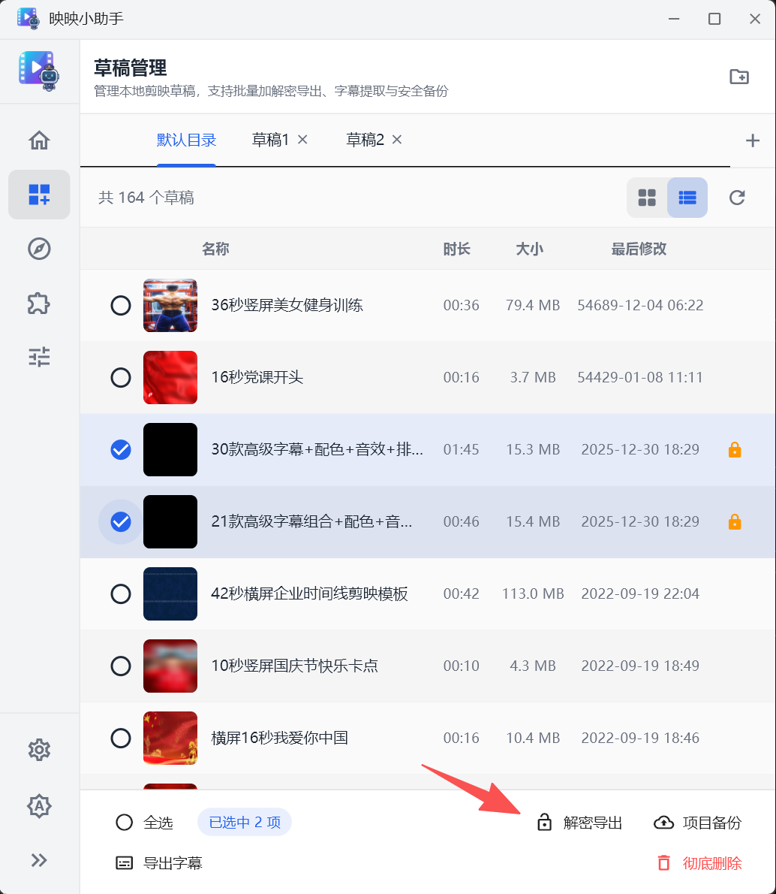
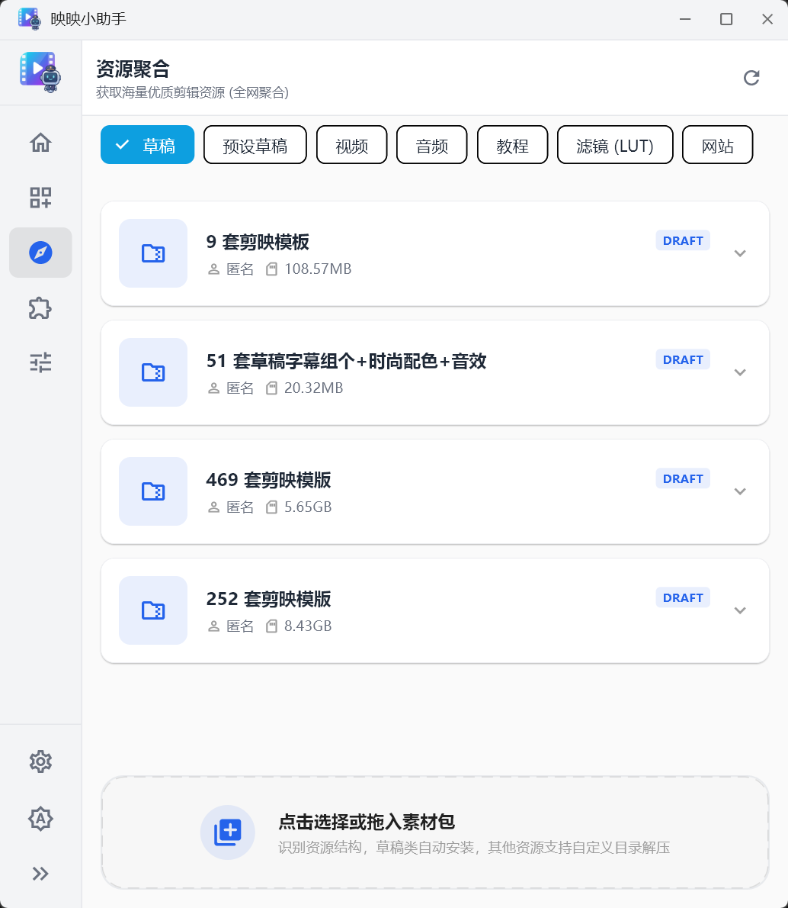
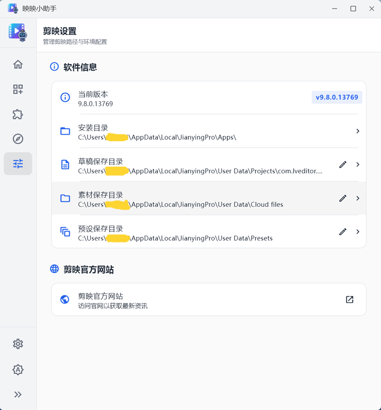

# 映映小助手 (Jianying Assistant) 用户指南

欢迎使用 **映映小助手**！这是一款专为剪映电脑版用户设计的效率提升工具，帮助您更好地管理草稿、优化系统性能以及获取优质素材。

下载地址
https://github.com/supertools2023/jianying_assistant_files

---

## 目录
1. [首页：使用概览](#首页使用概览)
2. [草稿管理：备份、字幕与加密](#草稿管理备份字幕与加密)
3. [资源中心：素材一键导入](#资源中心素材一键导入)
4. [剪映设置：路径、信息与维护](#剪映设置路径信息与维护)
5. [小助手设置：个性化与更新](#小助手设置个性化与更新)
6. [常见问题 (FAQ)](#常见问题-faq)

---

## 首页：使用概览

首页展示了您的“战果”统计以及常用功能的快捷入口。

- **统计数据**：查看您已下载的资源数、导出的字幕数以及处理的草稿数。
- **快捷入口**：快速跳转到草稿管理、资源中心或剪映设置。
- **状态检查**：实时监控剪映的安装状态及版本信息。

---

## 草稿管理：备份、字幕与加密

这是小助手的核心模块，旨在解决剪映自带管理器功能单一的问题。

### 1. 目录配置
如果您将剪映草稿存储在非默认盘符（如 D 盘或移动硬盘），点击顶部的 **“添加目录”** 图标，选择对应的文件夹即可。小助手会自动扫描该目录下的所有草稿。

### 2. 批量操作
勾选列表中的一个或多个草稿，底部将弹出操作菜单：
- **批量备份**：将选中的草稿文件夹完整复制到指定位置，安全备份您的心血。
- **导出字幕**：一键提取草稿中的所有文本，同时生成 **SRT** 和 **ASS** 格式的字幕文件。
- **批量删除**：彻底清理不再需要的草稿（需输入“确认删除”以防误操作）。

### 3. 高级：草稿加解密导出
- **加密导出**：将草稿的 JSON 配置文件加密，防止他人直接读取或保护隐私。
- **解密导出**：将加密的草稿还原为标准格式。

---

## 资源中心：素材一键导入

资源中心聚合了全网优质的视频、字体、图片和模板资源。

### 1. 浏览与下载
您可以按分类（如：视频、音频、课程、草稿模板）浏览资源。点击展开资源详情，查看分享者、大小及下载链接。

### 2. 拖拽即导入 (黑科技)
这是本软件最受欢迎的功能之一。
- **操作方式**：在电脑文件夹里选中您的素材（视频、音频等），直接**拖拽**到小助手资源中心底部的灰色区域。
- **效果**：小助手会自动将这些素材复制到剪映的默认素材库目录，您在剪映中打开“导入”界面时即可直接看到。

---

## 剪映设置：路径、信息与维护

灵活配置剪映的工作环境，并对系统进行必要的维护。

### 1. 软件信息
查看当前检测到的剪映版本以及安装目录。您可以直接点击安装目录路径来快速打开对应的文件夹。

### 2. 路径配置
您可以手动指定或更改以下关键路径：
- **草稿目录**：剪映保存工程文件的位置。
- **素材目录**：剪映下载和存储素材的默认位置。
- **预设目录**：存放配置信息和用户预设的位置。

### 3. 系统维护
- **锁定版本（禁止更新）**：如果您觉得当前剪映版本最稳定，不想被强制升级，可以开启 **“禁止自动更新”**。小助手会通过系统层面的配置拦截剪映的“强制升级”指令。
- **卸载管理**：提供官方卸载程序的快速入口，确保在需要重装时能进行干净的清理。

---

## 小助手设置：个性化与更新

管理“映映小助手”自身的偏好设置。

### 1. 外观与语言
- **主题模式**：支持“浅色”、“深色”及“跟随系统”切换，保护视力，适配您的审美。
- **语言切换**：支持中文与英文界面切换。

### 2. 软件关于与更新
- **版本检查**：实时检查小助手的新版本，确保您始终具备最新的功能和修复。
- **关于小助手**：查看软件介绍及 GitHub 开源地址。

---

## 常见问题 (FAQ)

**Q: 为什么提示“未检测到剪映安装信息”？**
A: 请确保您已安装官方剪映电脑版。如果是绿色版或更改过安装位置，请在设置中手动指定剪映的安装目录。

**Q: 导出的字幕没有内容？**
A: 请确认草稿中确实包含“文本”轨道，且已经完成了识别字幕操作。

**Q: 拖拽导入失败？**
A: 请检查“设置”中是否正确识别了剪映的素材存储路径。

---

*如果您有更多建议或发现 Bug，欢迎通过首页的“反馈”链接与我们联系。*
